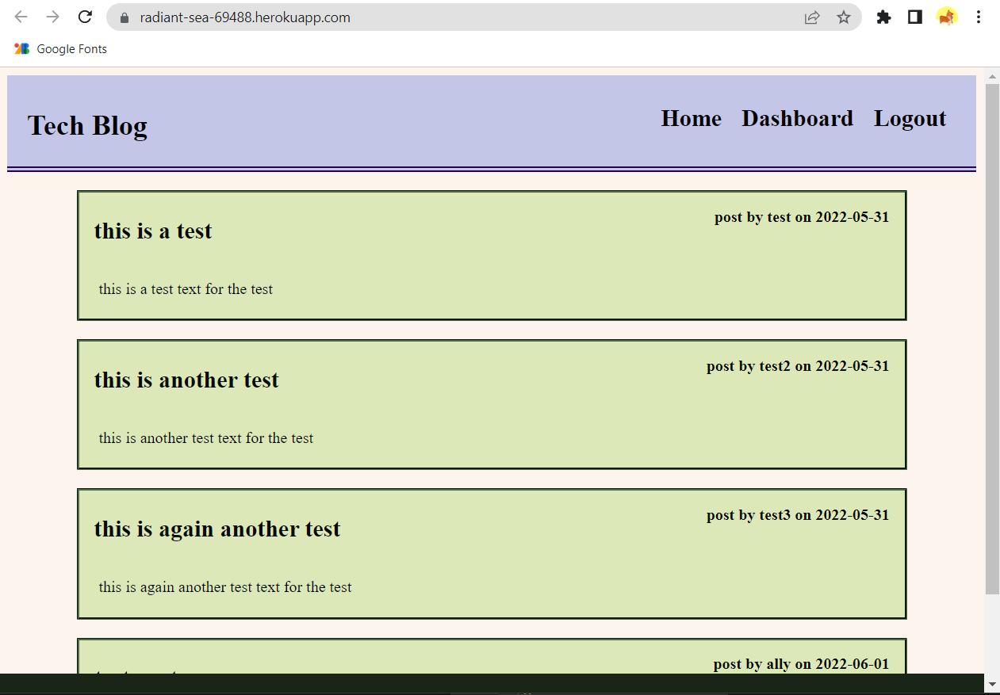

# tech-blog

## Description 

Here is a link to the deployed application on Heroku
https://radiant-sea-69488.herokuapp.com/

The goal for this assignment was to create a tech blog following the MVC paradigm, using handlebars, seqeulize and express session. The user will be able to create an account and sign in, publish blog posts, comments and edit and delete their posts. 

[](https://opensource.org/licenses/MIT)

## Table of Contents
- [Installation](#installation)
- [Usage](#usage)
- [License](#license)
- [Questions](#questions)

## Installation

To run this application make sure to download the following packages with ```npm i```
- express-handlebars
- express
- nodemon
- mysql2
- dotenv
- express session
- bcrypt
- connect-session-sequelize

## Usage

Here is a screenshot of the application



## License

This application is covered under MIT license. 

## Questions

https://github.com/allysonnostrand

You can reach me at allyson.nostrandd@gmail.com if you have any questions!